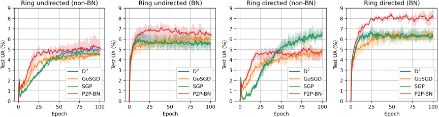
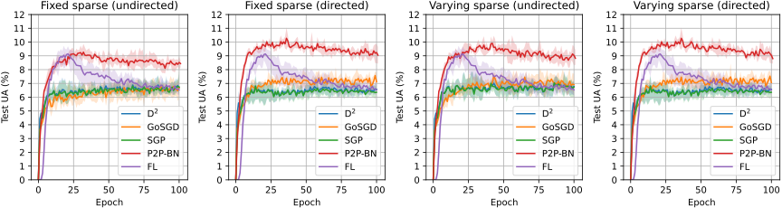
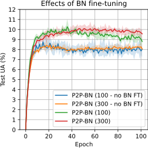

# P2P-BN

This is a repository of a paper [Peer-to-peer Deep Learning With Non-IID Data](https://). This paper proposes using Batch Normalization (BN) layers as an aid in normalizing non-IID data across decentralized agents. A variant of early stopping technique is developed that, in combination with BN layers, acts as a tool for fine-tuning the agent’s local model. Other decentralized algorithms used in the paper experiments are also a part of this project. 

---

Experiments were performed on a cleaned [Reddit](https://github.com/TalwalkarLab/leaf) dataset as it presents as a viable non-IID dataset.


Our experiments showed that using BN layers in a NN model benefits all decentralized algorithms. Figure below shows that all algorithms show positive feedback when using the model containing BN layers in a directed and undirected ring communication scheme.





P2P-BN substantially outperforms other decentralized algorithms when trained in a sparse topology with three neighbors per agent.




This good performance is due to using a variant of early stopping by only training BN layers when an agent cannot further improve the model. We show that in the figure below.




All result files of the experiments can be found on a shared [google drive](https://drive.google.com/drive/folders/1wu21lUgfCDK8_h8YoJAevGZjn14kyWLV?usp=sharing) and can also be reproduced following instructions bellow. To visualise existing results, use [`plot/experiment_viz.py`](plot/experiment_viz.py) and place the downloaded data in `log/` directory.

## Running simulations

#### Dataset preparation

Preprocessed dataset can be downloaded from a shared [google drive](https://drive.google.com/drive/folders/1p1RqD0eeTMxXgyFB7WxVgSXEmkHMqPdV?usp=sharing). Unpack the zip into the `data` directory. When completed, folder `data/reddit/clients/` must contain all `.h5` files containing the training, validation and test data. Tokenizer must be placed in `data/reddit/`

Alternatively, you can recreate this dataset by following the info in [Reddit.md](./data/Reddit.md).


**Simulations can be run either through [notebooks](/notebooks) or through cmd.**

### Run through cmd

#### Running agent simulation
```
$ test_p2p.py -h
usage: test_p2p.py [-h] --agent AGENT --clients CLIENTS
                   [--batch_size BATCH_SIZE] [--epochs EPOCHS] [--seed SEED]
                   [--model_v MODEL_V] [--lr LR] [--agent_pars AGENT_PARS]
                   [--graph_type GRAPH_TYPE] [--neighbors NEIGHBORS]
                   [--directed] [--vary VARY]

optional arguments:
  -h, --help              show this help message and exit
  --agent AGENT           Agent class to be used in simulations
  --clients CLIENTS       Number of clients to be used in simulation
  --batch_size BATCH_SIZE Batch size (default 50)
  --epochs EPOCHS         Number of cumulative epoch to train (default 30)
  --seed SEED             Seed (default None)
  --model_v MODEL_V       Model version to be used in simulation (default 4)
  --lr LR                 Agent learning rate (default 0.005)
  --agent_pars AGENT_PARS Json-type string with custom agent parameters (default None)
  --graph_type GRAPH_TYPE Graph type to create as a communication base (default sparse)
  --neighbors NEIGHBORS   Number of neighbors each agent has (default 3)
  --directed              Set this flag for directed communication (default false)
  --vary VARY             Time-varying interval of changing communication matrix (default -1)
```

Example:

```
$ python test_p2p.py --agent P2PAgent --clients 100 --epochs 100
```

Parameter `agent_pars` expects a dictionary of name-values forwarded to the agent class. Surround dictionary with single quotes and values within dict with double-quotes.
```
$ python test_p2p.py --agent P2PAgent --clients 100 --epochs 100 --agent_pars='{"early_stopping": true}'
```

#### Running Federated Learning simulation

```
$ test_fl.py -h
usage: test_fl.py [-h] --clients CLIENTS --sample_size SAMPLE_SIZE
                  [--epochs EPOCHS] [--batch_size BATCH_SIZE] [--seed SEED]
                  [--model_v MODEL_V] [--slr SLR] [--clr CLR]

optional arguments:
  -h, --help                show this help message and exit
  --clients CLIENTS         Number of clients to be used in simulation
  --sample_size SAMPLE_SIZE Number of clients to sample in each FL round
  --epochs EPOCHS           Number of cumulative epoch to train (default 30)
  --batch_size BATCH_SIZE   Batch size (default 50)
  --seed SEED               Seed (default None)
  --model_v MODEL_V         Model version to be used in simulation (default 2)
  --slr SLR                 Server learning rate (default 0.005)
  --clr CLR                 Client learning rate (default 0.005)
```

Example:
```
$ python test_fl.py --clients 100 --sample_size 10
```
